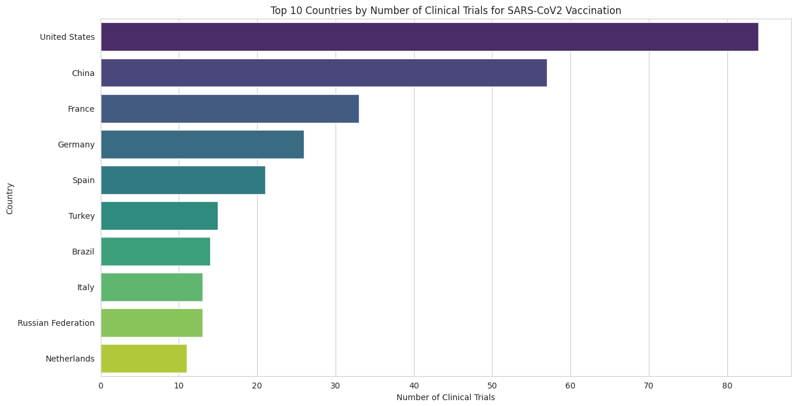

## Report: Summary of Clinical Trials Data Extraction and Analysis

### Methodology

#### 1. Data Extraction

- **API Request**: The data was extracted from [ClinicalTrials.gov](https://clinicaltrials.gov/) using their [API](https://clinicaltrials.gov/data-api/api). The query was designed to fetch studies related to "SARS-CoV2" with the intervention "Vaccination".
- **Pagination and Limits**: The API request was set to fetch up to 1000 results at a time. To handle more extensive datasets, additional looping and handling of potential IP bans would be necessary.
- **Data Conversion**: The JSON response from the API was converted to a structured `TrialsResponse` object, and relevant fields were extracted from each study. The API schema is converted to a Python class, using [quicktype](https://app.quicktype.io/). By converting the raw json response to a python object, helps in getting a good developer experience.

#### 2. Data Processing

- **Data Structure**: A `Data` class was created to structure the extracted data, including fields like ID, research title, initiation date, status, results availability, locations, and organization.
- **Country Count**: The locations of clinical trials were extracted and counted to determine the number of studies conducted in each country.

#### 3. Database Storage

- **SQLite Database**: The extracted data was stored in an SQLite database named `research.db`.
- **DataFrame**: The `pandas` library was used to create a DataFrame from the extracted data. The locations were stored as a comma-separated string in the database.

### Challenges

1. **API Limits**: Handling the maximum number of results per request and potential IP bans if multiple requests are needed.
2. **Data Consistency**: Ensuring that all relevant data fields are present and correctly formatted in the API response.
3. **Location Extraction**: Properly extracting and processing the locations from the nested structures within the API response.
4. **Database Efficiency**: Efficiently storing and querying the data in the SQLite database, especially for larger datasets.

### Insights

1. **Geographical Distribution**: The country count provides insight into the geographical distribution of clinical trials related to SARS-CoV2 vaccinations.
2. **Status and Results**: The status and availability of results for these studies can help understand the progress and completion rate of clinical research in this area.
3. **Organizational Involvement**: Analyzing the organizations involved in these studies can highlight key players in the field.

### Visualizations

Let's create visualizations to better understand the distribution of clinical trials by country and the status of these studies.

#### 1. Import Libraries

```python
import matplotlib.pyplot as plt
import seaborn as sns

# Set the aesthetic style of the plots
sns.set_style("whitegrid")
```

#### 2. Plotting Country Distribution

```python
# Convert the country count dictionary to a DataFrame
country_df = pd.DataFrame(list(country_count_sorted.items()), columns=["Country", "Count"])

# Plot the top 10 countries with the most clinical trials
plt.figure(figsize=(12, 8))
sns.barplot(x="Count", y="Country", data=country_df.head(10), palette="viridis")
plt.title("Top 10 Countries by Number of Clinical Trials for SARS-CoV2 Vaccination")
plt.xlabel("Number of Clinical Trials")
plt.ylabel("Country")
plt.show()
```


### Conclusion

The analysis of clinical trials related to SARS-CoV2 vaccinations provides valuable insights into the global efforts and progress in this crucial area of research. The methodology outlined ensures a structured approach to data extraction, processing, and storage, while the visualizations highlight key trends and distributions in the dataset. Further analysis could delve deeper into the specific outcomes of these studies and their impact on vaccination strategies worldwide.